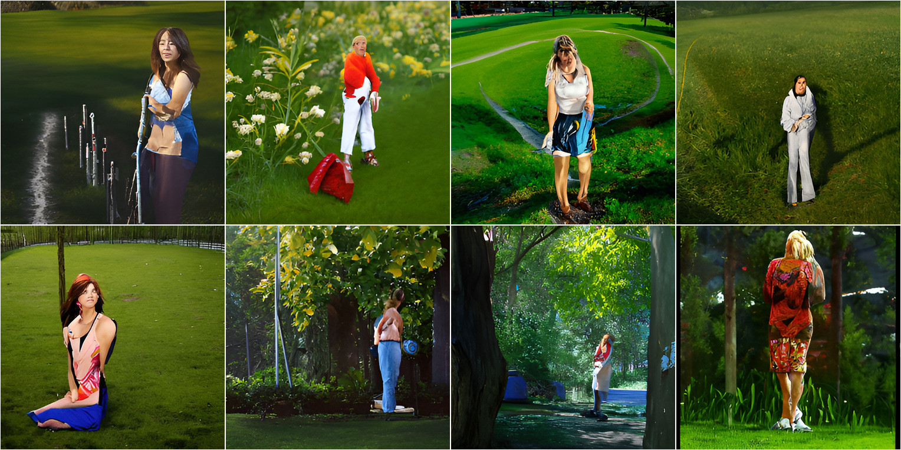
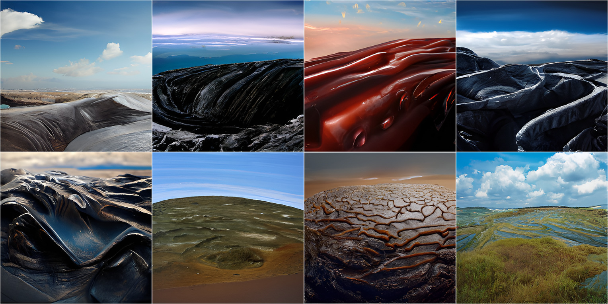
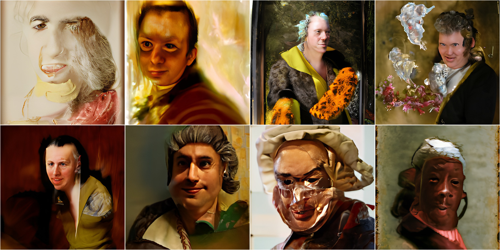
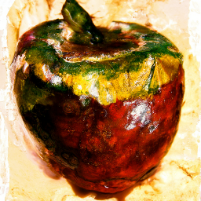
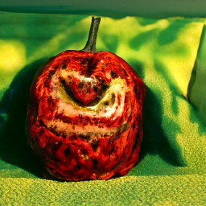
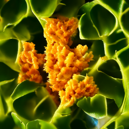
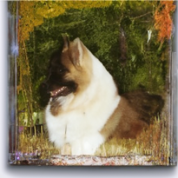

# CLIP-Guided-Diffusion
Just playing with getting CLIP Guided Diffusion running locally, rather than having to use colab. 

Original colab notebooks by Katherine Crowson (https://github.com/crowsonkb, https://twitter.com/RiversHaveWings):

* Original 256x256 notebook: [![Open In Colab][colab-badge]][colab-notebook1]

[colab-notebook1]: <https://colab.research.google.com/drive/12a_Wrfi2_gwwAuN3VvMTwVMz9TfqctNj#scrollTo=X5gODNAMEUCR>
[colab-badge]: <https://colab.research.google.com/assets/colab-badge.svg>

It uses OpenAI's 256x256 unconditional ImageNet diffusion model (https://github.com/openai/guided-diffusion)

* Original 512x512 notebook: [![Open In Colab][colab-badge]][colab-notebook2]

[colab-notebook2]: <https://colab.research.google.com/drive/1QBsaDAZv8np29FPbvjffbE1eytoJcsgA#scrollTo=VnQjGugaDZPJ>
[colab-badge]: <https://colab.research.google.com/assets/colab-badge.svg>

It uses a 512x512 unconditional ImageNet diffusion model fine-tuned from OpenAI's 512x512 class-conditional ImageNet diffusion model (https://github.com/openai/guided-diffusion)

Together with CLIP (https://github.com/openai/CLIP), they connect text prompts with images.

Either the 256 or 512 model can be used here (by setting `--output_size` to either 256 or 512)

Some example images:

"A woman standing in a park":



"An alien landscape":



"A painting of a man":



*images enhanced with [Real-ESRGAN](https://github.com/xinntao/Real-ESRGAN)

You may also be interested in [VQGAN-CLIP](https://github.com/nerdyrodent/VQGAN-CLIP)

## Environment
* Ubuntu 20.04 (Windows untested but should work)
* Anaconda
* Nvidia RTX 3090

Typical VRAM requirments:
* 256 defaults: 10 GB
* 512 defaults: 18 GB

## Set up

This example uses [Anaconda](https://www.anaconda.com/products/individual#Downloads) to manage virtual Python environments.

Create a new virtual Python environment for CLIP-Guided-Diffusion:
```sh
conda create --name cgd python=3.9
conda activate cgd
```

Download and change directory:
```sh
git clone https://github.com/nerdyrodent/CLIP-Guided-Diffusion.git
cd CLIP-Guided-Diffusion
```

Run the setup file:
```sh
./setup.sh
```

Or if you want to run the commands manually:
```sh
# Install dependencies

pip3 install torch==1.9.0+cu111 torchvision==0.10.0+cu111 torchaudio==0.9.0 -f https://download.pytorch.org/whl/torch_stable.html
git clone https://github.com/openai/CLIP
git clone https://github.com/crowsonkb/guided-diffusion
pip install -e ./CLIP
pip install -e ./guided-diffusion
pip install lpips matplotlib

# Download the diffusion models

curl -OL --http1.1 'https://the-eye.eu/public/AI/models/512x512_diffusion_unconditional_ImageNet/512x512_diffusion_uncond_finetune_008100.pt'
curl -OL 'https://openaipublic.blob.core.windows.net/diffusion/jul-2021/256x256_diffusion_uncond.pt'
```
## Run

The simplest way to run is just to pass in your text prompt. For example:

```sh
python generate_diffuse.py -p "A painting of an apple"
```
</img>

### Multiple prompts

Text and image prompts can be split using the pipe symbol in order to allow multiple prompts. You can also use a colon followed by a number to set a weight for that prompt. For example:

```sh
python generate_diffuse.py -p "A painting of an apple:1.5|a surreal painting of a weird apple:0.5"
```
</img>

### Other options

There are a variety of other options to play with. Use help to display them:
```sh
python generate_diffuse.py -h
```

```sh
usage: generate_diffuse.py [-h] [-p PROMPTS] [-ip IMAGE_PROMPTS] [-ii INIT_IMAGE]
[-st SKIP_TIMESTEPS] [-is INIT_SCALE] [-m CLIP_MODEL] [-t TIMESTEPS]
[-ds DIFFUSION_STEPS] [-se SAVE_EVERY] [-bs BATCH_SIZE] [-nb N_BATCHES] [-cuts CUTN]
[-cutb CUTN_BATCHES] [-cutp CUT_POW] [-cgs CLIP_GUIDANCE_SCALE]
[-tvs TV_SCALE] [-rgs RANGE_SCALE] [-os IMAGE_SIZE] [-s SEED] [-o OUTPUT] [-nfp] [-pl]
```

### init_image 
* 'skip_timesteps' needs to be between approx. 200 and 500 when using an init image.
* 'init_scale' enhances the effect of the init image, a good value is 1000.

### timesteps
The number of timesteps, or one of ddim25, ddim50, ddim150, ddim250, ddim500, ddim1000. Must go into diffusion_steps.

### image guidance
* 'clip_guidance_scale' Controls how much the image should look like the prompt.
* 'tv_scale' Controls the smoothness of the final output.
* 'range_scale' Controls how far out of range RGB values are allowed to be.

Examples using a number of options:
```sh
python generate_diffuse.py -p "An amazing fractal" -os=256 -cgs=1000 -tvs=50 -rgs=50 -cuts=16 -cutb=4 -t=200 -se=200 -m=ViT-B/32 -o=my_fractal.png
```
</img>

```sh
python generate_diffuse.py -p "An impressionist painting of a cat:1.75|trending on artstation:0.25" -cgs=500 -tvs=55 -rgs=50 -cuts=16 -cutb=2 -t=100 -ds=2000 -m=ViT-B/32 -pl -o=cat_100.png
```


(Funny looking cat, but hey!)

## Videos

Using the ```-vid``` option saves the diffusion steps and makes a video. The steps can also be upscaled if you have the portable version of https://github.com/xinntao/Real-ESRGAN installed locally, and opt to do so.

## Other repos

You may also be interested in https://github.com/afiaka87/clip-guided-diffusion

For upscaling images, try https://github.com/xinntao/Real-ESRGAN

## Citations

```bibtex
@misc{unpublished2021clip,
    title  = {CLIP: Connecting Text and Images},
    author = {Alec Radford, Ilya Sutskever, Jong Wook Kim, Gretchen Krueger, Sandhini Agarwal},
    year   = {2021}
}
```
* Guided Diffusion - https://github.com/openai/guided-diffusion
* Katherine Crowson - <https://github.com/crowsonkb>
